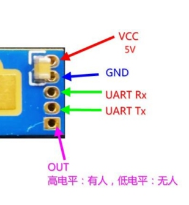
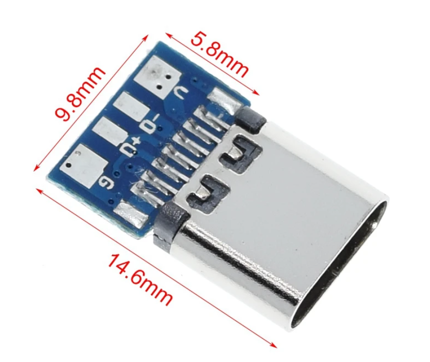
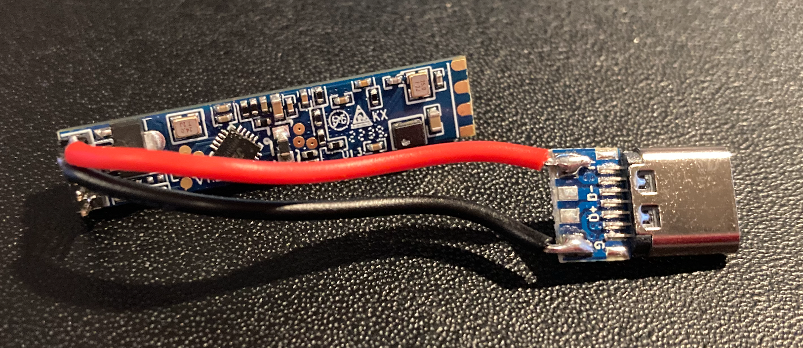

# Sensor_LD24B

This is a mmWave prescense sensor based on the LD2410B sensor, primarily for use in Home Assistant.

## Parts needed

Model | Link
---- | ----
HLK-LD2410B-P (With BLE) | [AliExpress link](https://www.aliexpress.com/item/1005004351593073.html)
USB-C Breakout, Type-C Female | [AliExpress link](https://www.aliexpress.com/item/1005001337982060.html)

## Assembly

 1. Connect pin `V` on the USB breakout to pin `VCC` on the LD2410B board.
 2. Connect pin `G` on the USB breakout to pin `GND` on the LD2410B board.

## Enclosure

The enclosure consists of two parts that is snapped together. 
 1. Insert the LD2410B board into the designated slot in the enclosure, use either double sided tape or hot glue if needed. 
 2. Insert the USB breakout into the lid, use hot glue if needed. 
 3. Snap on the lid.

 ## Files

 The files for the enclosure is located in the `Enclosure` folder.

 File name | Description
 ---- | ----
LD2410B Box.3mf | Box part of enclosure
LD2410B Lid.3mf | Lid part of the enclosure
LD2410B Enclosure.f3d | Fusion360 file

## Software

Home Assistant supports the LD2410B sensor out of the box, the only thing needed is activation of the Bluetooth support, either natively or via a Bluetooth proxy.Check out the Home Assistant [documentation](https://www.home-assistant.io/integrations/bluetooth/) for more information.

